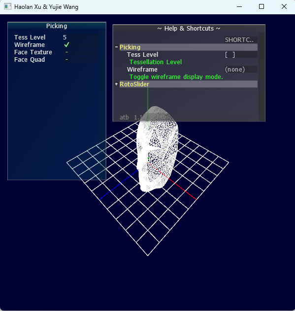
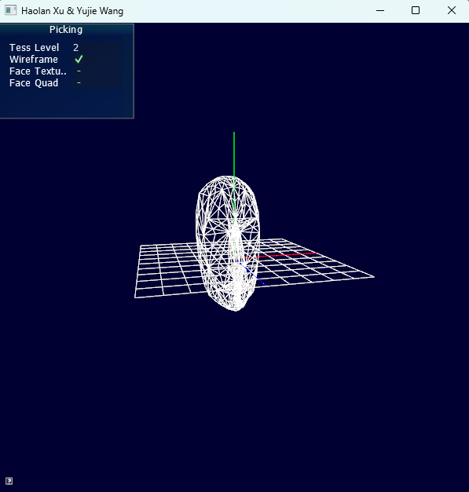
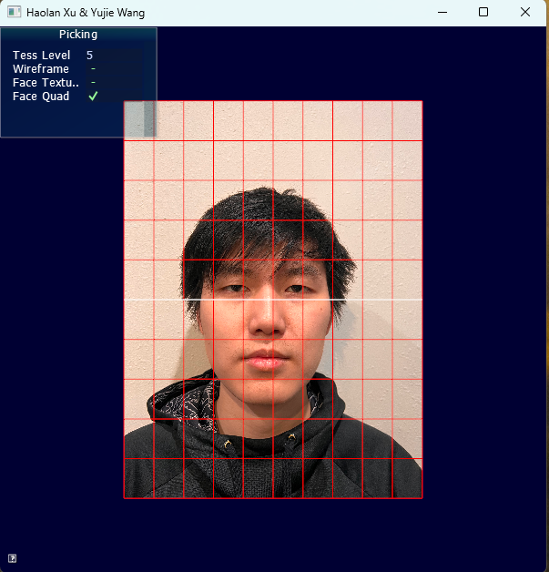
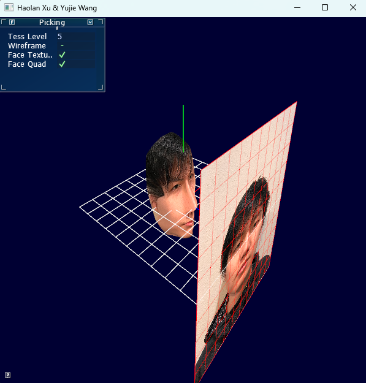
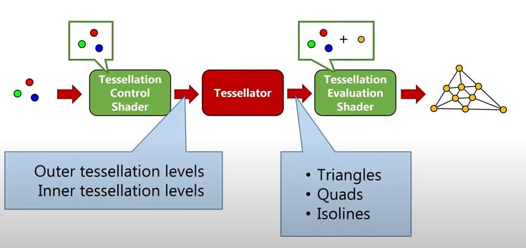

# Self_face_head

## Set up

* Operating & compiling system: Cmake + Visual Studio 2019(x64) in Windows11
* Framework: [OpenGL](https://github.com/opengl-tutorials/ogl)

## Pipeline (* what I did)

### Create the head model in blender*

### Integrate all functions into the GUI*

### Display face geometry as a triangular mesh*

### Map the facial pictures onto the head

### Use PN triangle tessellation to refine the model*

The tessellation shader components:

In our project, we set 9 levels of detail for our tessellation.

## Result
